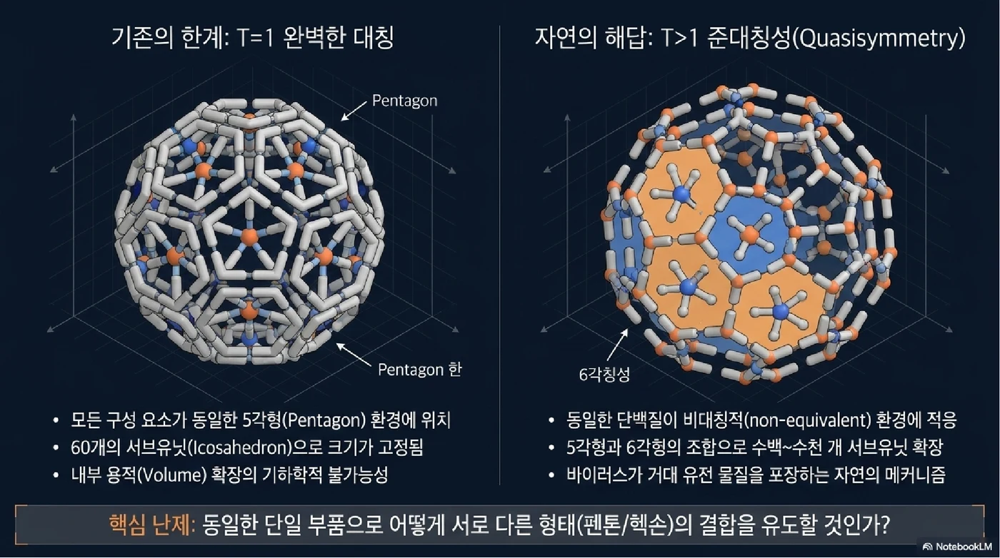
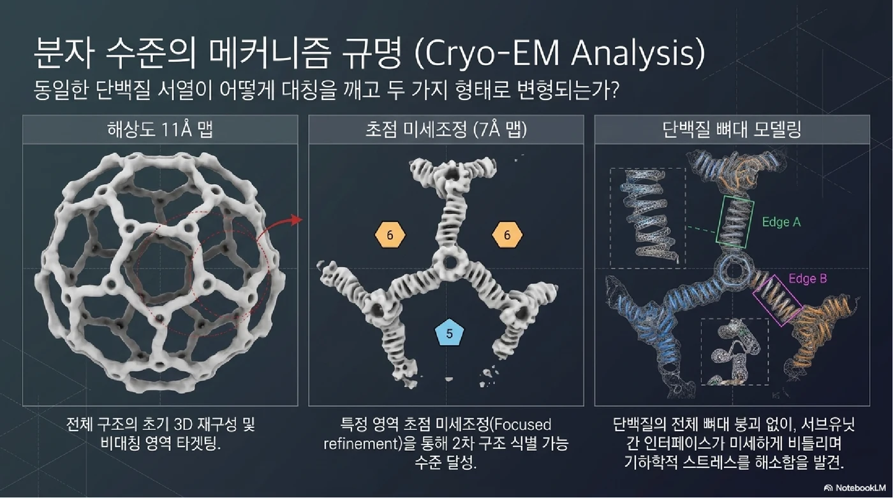
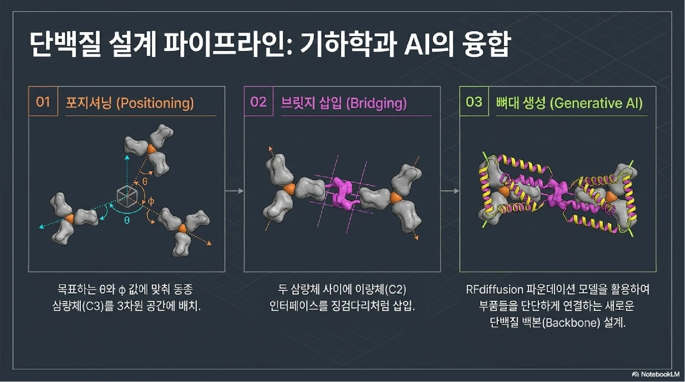
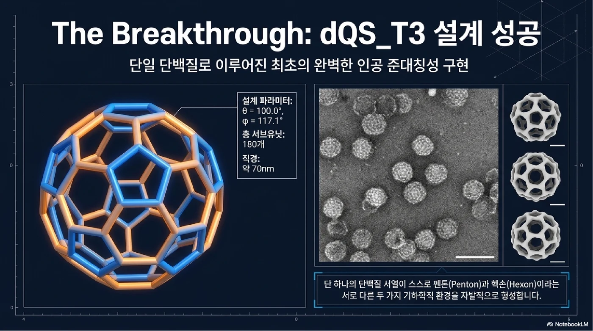
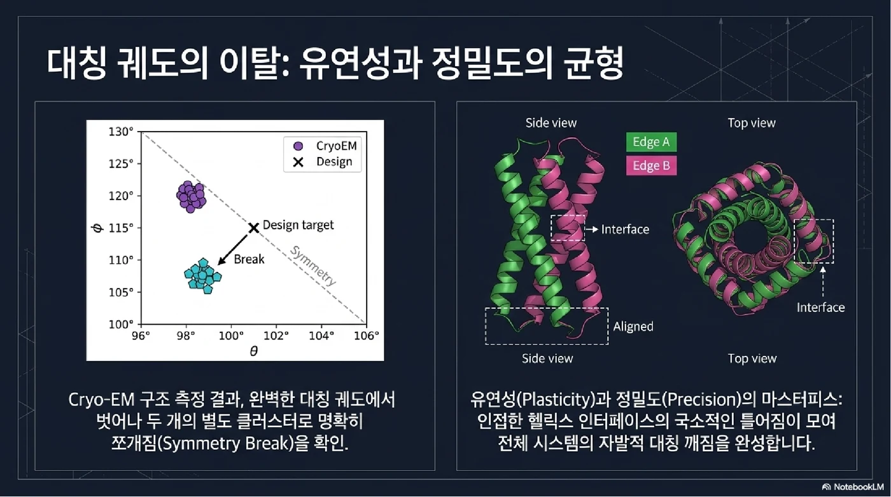
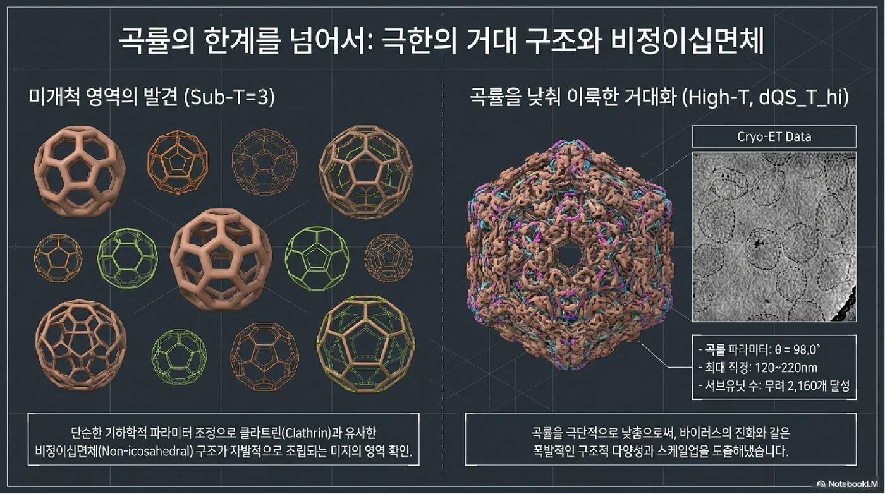

바이러스를 떠올리면 보통 질병을 일으키는 존재라고 생각하기 쉽습니다. 그러나 구조생물학의 관점에서 바이러스는 매우 정교한 **나노미터 크기의 건축물**이기도 합니다.

많은 바이러스는 자신의 유전물질을 보호하기 위해 단백질 껍질인 <strong>캡시드(capsid)</strong>를 만듭니다. 흥미로운 점은 바이러스가 제한된 종류의 단백질 블록을 반복해서 사용하면서도, 수백 개에서 수천 개의 단백질이 모인 거대한 구형 구조를 만든다는 것입니다.

이번 글에서는 2026년 *Nature*에 발표된 논문 <strong>「Design of one-component quasisymmetric protein nanocages」</strong>를 바탕으로, 인공지능 단백질 설계 기술이 어떻게 바이러스 캡시드와 비슷한 단백질 나노케이지를 만들었는지 정리합니다.

## 연구의 핵심 질문

이 연구의 출발점은 비교적 단순합니다.

> 단 하나의 단백질 구성요소만 사용해서, 바이러스 캡시드처럼 크고 복잡한 구형 단백질 구조를 인공적으로 만들 수 있을까?

기존의 단백질 나노케이지 설계에서는 여러 종류의 단백질을 조합하거나, 비교적 작은 대칭 구조를 만드는 방식이 많이 사용되었습니다. 하지만 구조가 커질수록 문제가 복잡해집니다.

큰 구형 구조를 만들려면 같은 단백질이라도 위치에 따라 조금씩 다른 역할을 해야 합니다. 어떤 위치에서는 오각형 배열을 만들고, 다른 위치에서는 육각형 배열을 만들어야 하기 때문입니다.

즉, 이 연구의 핵심은 <strong>하나의 단백질 블록이 여러 위치에서 서로 다른 구조적 환경을 받아들이도록 설계할 수 있는가</strong>입니다.

## 단백질 나노케이지란 무엇인가

<strong>단백질 나노케이지(protein nanocage)</strong>는 단백질들이 스스로 조립되어 만든 속이 빈 나노미터 크기의 구조입니다.

쉽게 비유하면 분자 크기의 작은 택배 상자라고 볼 수 있습니다. 바깥쪽은 단백질 껍질로 둘러싸여 있고, 안쪽에는 공간이 있습니다. 이 내부 공간에는 이론적으로 약물, 백신 성분, 효소, 유전자 치료 물질 같은 생물학적 물질을 담을 수 있습니다.

그래서 단백질 나노케이지는 다음과 같은 분야에서 관심을 받고 있습니다.

- 약물 전달체
- 백신 항원 표시 플랫폼
- 효소 반응 공간
- 유전자 치료 물질 전달
- 생체친화적 나노소재

특히 한 종류의 단백질만으로 큰 나노케이지를 만들 수 있다면 장점이 큽니다. 여러 단백질을 정확한 비율로 생산하고 섞는 과정이 줄어들기 때문입니다. 설계와 생산이 단순해지고, 재현성 있는 조립체를 만들 가능성도 높아집니다.

## 왜 축구공 구조가 중요한가

축구공을 보면 오각형과 육각형이 함께 배열되어 있습니다. 육각형만 계속 붙이면 벌집처럼 평평한 구조가 됩니다. 반대로 오각형이 적절히 섞이면 표면이 휘어지며 공 모양으로 닫힐 수 있습니다.

바이러스 캡시드도 비슷한 원리를 사용합니다. 같은 단백질 블록이 어떤 위치에서는 오각형 주변에 놓이고, 어떤 위치에서는 육각형 주변에 놓입니다. 전체적으로는 규칙적인 구형 구조를 만들지만, 세부적으로 보면 각 단백질이 놓인 환경은 완전히 같지 않습니다.

이런 구조를 <strong>준대칭(quasisymmetry)</strong>이라고 합니다.

완전한 대칭 구조에서는 모든 단백질 블록이 같은 환경에 놓입니다. 하지만 큰 바이러스 캡시드에서는 같은 단백질이라도 위치에 따라 조금씩 다른 상호작용을 해야 합니다. 논문은 이 점을 큰 단백질 조립체 설계의 핵심 난제로 봅니다.

## 준대칭과 대칭 깨짐

논문에서 중요한 개념은 <strong>자발적 대칭 깨짐(spontaneous symmetry breaking)</strong>입니다.

처음에는 모두 같은 단백질 블록이지만, 구형 구조로 조립되는 과정에서 각 블록이 놓이는 위치가 달라집니다. 어떤 블록은 오각형 배열에 참여하고, 어떤 블록은 육각형 배열에 참여합니다.

이 과정에서 모든 단백질이 완전히 같은 자세와 결합 방식을 유지할 수 없습니다. 구조가 닫힌 공 모양이 되려면 일부 단백질은 조금 다르게 휘어지고, 조금 다른 각도로 이웃 단백질과 만나야 합니다.

즉, 대칭 깨짐은 구조가 망가지는 현상이 아니라, 오히려 큰 구형 구조를 만들기 위해 필요한 조건입니다.

핵심은 다음과 같이 정리할 수 있습니다.

- 평평한 벌집 구조는 육각형만으로도 만들 수 있습니다.
- 닫힌 공 모양 구조는 오각형과 육각형이 함께 필요합니다.
- 같은 단백질 블록이라도 위치에 따라 다른 역할을 해야 합니다.
- 이 차이가 생기는 과정이 대칭 깨짐입니다.

## 연구진의 설계 전략: 각도와 곡률을 먼저 정하다

이 연구에서 연구진은 단백질 사이의 모든 원자 수준 결합을 처음부터 하나하나 지정하려 하지 않았습니다. 대신 전체 구조가 어떤 곡률과 각도를 가져야 하는지 먼저 설계했습니다.

논문에서는 설계 공간을 설명하기 위해 두 가지 핵심 변수를 사용합니다.

- **θ(theta)**: 단백질 블록들이 전체적으로 얼마나 휘어져 구형 구조를 만들 수 있는지와 관련된 값
- **ϕ(phi)**: 이웃한 단백질 블록들이 서로 어떤 각도로 만나는지와 관련된 값

이 두 값을 조절하면 단백질 블록은 서로 다른 형태의 조립체를 만들 수 있습니다.

- θ와 ϕ가 특정 조건을 가지면 작은 정이십면체형 구조가 됩니다.
- 곡률이 낮아지면 더 큰 구형 구조가 만들어질 수 있습니다.
- 너무 평평하면 닫힌 케이지가 아니라 2차원 격자에 가까워질 수 있습니다.

이 접근은 단백질 설계의 관점을 바꿉니다. 개별 결합 하나하나를 모두 통제하는 것이 아니라, <strong>전체 시스템의 성질을 먼저 설계하고 조립 과정에서 원하는 구조가 나타나도록 유도</strong>하는 방식입니다.

## RFdiffusion이 한 역할

이번 연구에서 중요한 도구는 <strong>RFdiffusion</strong>입니다. RFdiffusion은 RoseTTAFold diffusion 기반의 생성형 단백질 설계 모델입니다.

이미지 생성 AI가 사용자의 조건에 맞춰 새로운 이미지를 만드는 것처럼, RFdiffusion은 연구자가 원하는 구조 조건에 맞춰 새로운 단백질 골격을 설계할 수 있습니다.

이 연구에서 RFdiffusion은 단백질 블록 사이를 연결하는 새로운 단백질 구조를 만드는 데 사용되었습니다. 연구진은 먼저 C3 대칭 단위와 C2 결합 인터페이스를 목표 각도에 맞게 배치한 뒤, RFdiffusion으로 이들을 안정적으로 이어주는 단백질 골격을 생성했습니다.

쉽게 말하면 RFdiffusion은 이 연구에서 <strong>단백질 블록을 원하는 각도로 연결해주는 AI 설계 도구</strong> 역할을 한 것입니다.

이후 설계된 단백질은 계산으로만 검토된 것이 아니라 실제 실험으로 이어졌습니다. 연구진은 단백질을 대장균에서 발현시키고 정제한 뒤, 전자현미경으로 조립체의 형태를 확인했습니다.

## 실제 실험 결과

논문에서 연구진은 다양한 크기의 단백질 나노케이지를 확인했습니다. 전자현미경 분석 결과, 설계된 구조는 <strong>T=3부터 T=36까지</strong>의 케이지를 형성했습니다.

논문 초록에 따르면 확인된 구조는 다음과 같습니다.

- T=3부터 T=36까지의 단백질 케이지
- 180개에서 2,160개의 단백질 소단위체
- 약 68nm에서 220nm에 이르는 지름
- 1 < T < 3 범위의 비정이십면체형 클라트린 유사 조립체

특히 T=3 구조는 약 70nm 크기의 비교적 균일한 케이지로 관찰되었고, 설계 모델과 잘 맞는 구조를 보였습니다. 반면 더 큰 T 번호의 구조들은 크기와 모양이 더 다양하게 나타났습니다.

이 차이는 큰 구조일수록 인접한 T 번호 사이의 에너지 차이가 작아지고, 여러 형태가 함께 형성될 수 있기 때문으로 해석할 수 있습니다.

## T 번호는 무엇을 의미하나

논문에 자주 나오는 <strong>T 번호</strong>는 triangulation number, 즉 삼각분할 수를 뜻합니다. 바이러스 캡시드 구조를 설명할 때 많이 사용되는 개념입니다.

간단히 말하면 T 번호가 클수록 더 많은 단백질 소단위체가 들어가며, 더 큰 캡시드 구조가 만들어집니다.

- **T=1**: 가장 단순한 정이십면체형 구조
- **T=3**: 오각형과 육각형 배열이 함께 나타나는 더 큰 구조
- **T=13 이상**: 훨씬 큰 바이러스 유사 구조
- **T=36**: 이 연구에서 확인된 큰 단백질 나노케이지 범위

이 연구가 의미 있는 이유는 T=3 수준의 구조를 넘어, T=36에 이르는 큰 구조까지 한 종류의 단백질 구성요소로 만들 수 있음을 보여주었기 때문입니다.

## 이 연구가 중요한 이유

이 논문은 단순히 AI로 예쁜 단백질 공 모양을 만들었다는 이야기가 아닙니다. 생명과학, 물리학, 단백질 공학, 생성형 AI가 만나는 지점을 보여주는 연구입니다.

첫째, <strong>바이러스가 큰 캡시드를 만드는 원리를 인공적으로 구현</strong>했습니다. 자연계의 바이러스가 사용하는 준대칭 원리를 분석하고, 이를 단백질 설계에 적용했다는 점에서 의미가 큽니다.

둘째, <strong>큰 내부 공간을 가진 단백질 나노케이지 설계 가능성</strong>을 보여주었습니다. 이런 구조는 앞으로 약물 전달, 백신 플랫폼, 효소 탑재, 생체소재 개발 등에 활용될 가능성이 있습니다.

셋째, <strong>단백질 설계 방식의 확장</strong>을 보여주었습니다. 기존에는 단백질 간 결합을 정밀하게 하나씩 맞추는 접근이 중요했다면, 이 연구는 전체 구조의 곡률과 조립 원리를 먼저 설계하는 방식도 가능하다는 점을 보여줍니다.

넷째, <strong>생성형 AI가 실제 실험 가능한 단백질 구조 설계에 기여할 수 있음</strong>을 보여줍니다. RFdiffusion은 단순한 예측 도구가 아니라, 새로운 단백질 구조를 만들어내는 설계 도구로 사용되었습니다.

## 용어 정리

| 용어 | 의미 |
| --- | --- |
| 단백질 나노케이지 | 단백질이 스스로 조립되어 만든 나노미터 크기의 속 빈 구조 |
| 캡시드 | 바이러스 유전물질을 감싸는 단백질 껍질 |
| 준대칭 | 전체적으로는 규칙적이지만 위치에 따라 단백질 환경이 조금씩 다른 구조 |
| 대칭 깨짐 | 같은 단백질 블록이 조립 과정에서 서로 다른 위치와 역할을 갖게 되는 현상 |
| RFdiffusion | 원하는 조건에 맞는 단백질 구조를 생성하는 AI 기반 단백질 설계 모델 |
| T 번호 | 바이러스 캡시드의 크기와 복잡성을 나타내는 삼각분할 수 |
| C3 대칭 | 120도씩 회전했을 때 같은 모양이 되는 3방향 대칭 |
| C2 대칭 | 180도 회전했을 때 같은 모양이 되는 2방향 대칭 |
| nsEM | 음성염색 전자현미경. 단백질 조립체의 전체 형태를 확인하는 데 사용 |
| cryo-EM | 초저온 전자현미경. 단백질 구조를 고해상도로 분석하는 데 사용 |

## 마무리

이번 연구는 AI가 생명과학 연구에서 어떤 역할을 할 수 있는지를 잘 보여줍니다. AI는 논문을 요약하거나 데이터를 정리하는 도구를 넘어, 이제 새로운 단백질 구조를 설계하고 실제 실험으로 검증할 수 있는 단계까지 확장되고 있습니다.

바이러스는 오랜 진화 속에서 효율적인 캡시드 구조를 만들어왔습니다. 연구진은 그 원리를 이해하고, RFdiffusion 같은 생성형 AI를 이용해 인공 단백질 나노케이지를 설계했습니다.

생명과학은 이제 관찰의 학문을 넘어 설계의 학문으로 확장되고 있습니다. 이 연구는 바이러스, 단백질, 인공지능을 함께 바라볼 때 어떤 새로운 가능성이 열리는지 보여주는 좋은 사례입니다.

## 원논문

Lee, S., Chmielewski, D., Wang, S. et al. **Design of one-component quasisymmetric protein nanocages.** *Nature* (2026). Published 20 May 2026.  
DOI: [10.1038/s41586-026-10554-z](https://doi.org/10.1038/s41586-026-10554-z)
