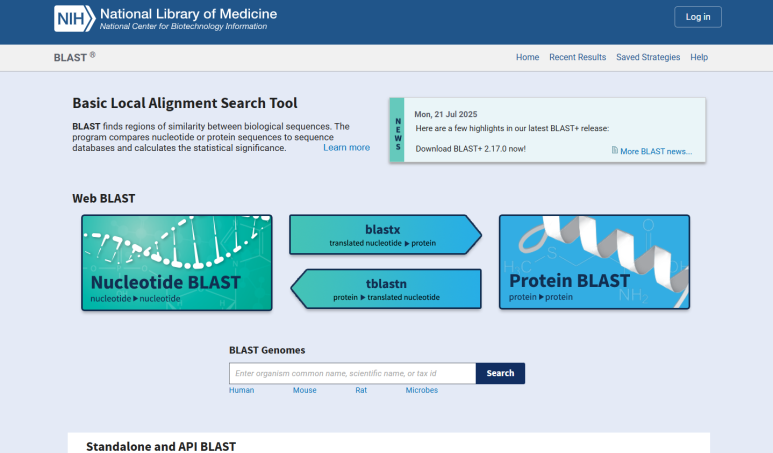
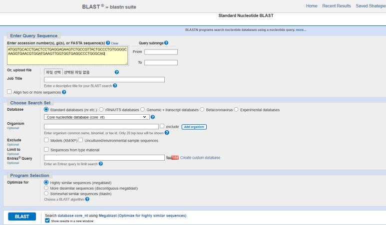
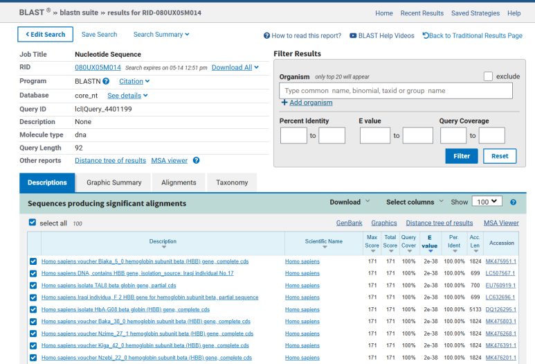

DNA 서열은 A, T, G, C 네 글자로 이루어진 긴 문자열입니다. 하지만 문자열만 보고 그 서열이 어떤 생물의 어떤 유전자에서 온 것인지 바로 알기는 어렵습니다.

이때 사용할 수 있는 대표적인 생명정보학 도구가 **NCBI BLAST**입니다. BLAST는 입력한 DNA나 단백질 서열을 데이터베이스의 서열과 비교해, 가장 비슷한 서열을 찾아주는 검색 도구입니다.

이번 글은 직접 실습한 내용을 바탕으로, **미지의 DNA 서열을 BLAST에 넣고 어떤 유전자인지 추론하는 과정**을 정리한 글입니다.

### 실습 목표

이번 실습의 질문은 단순합니다.

> 이 미지의 DNA 서열은 어떤 생물의 어떤 유전자일까?

실습에서 사용한 미지 서열은 다음과 같습니다.

```text
>unknown_DNA_sample
ATGGTGCACCTGACTCCTGAGGAGAAGTCTGCCGTTACTGCCCTGTGGGGCAAGGTGAACGTGGATGAAGTTGGTGGTGAGGCCCTGGGCAG
```

이 서열은 총 **92 bp** 길이의 DNA 조각입니다. 길이가 짧기 때문에 서열만 보고 생물종이나 유전자 이름을 판단하기는 어렵습니다. 따라서 BLAST를 이용해 데이터베이스에 등록된 서열과 비교해야 합니다.

### 먼저 알아두면 좋은 개념

BLAST 실습을 이해하려면 몇 가지 용어를 먼저 정리해두는 것이 좋습니다.

| 개념 | 의미 |
| --- | --- |
| Query | BLAST에 입력하는 분석 대상 서열입니다. 이번 실습에서는 92 bp DNA 서열이 Query입니다. |
| Database | Query와 비교할 기준 서열 모음입니다. NCBI에는 여러 생물종의 DNA, RNA, 단백질 서열이 저장되어 있습니다. |
| Alignment | 두 서열을 나란히 맞추어 어느 부분이 같은지 비교하는 과정입니다. |
| FASTA 형식 | 서열 이름과 서열 정보를 함께 적는 생물정보학 표준 형식입니다. |

이번 실습 서열의 첫 줄에 있는 `>unknown_DNA_sample`은 서열 이름입니다. 그 아래 줄의 A, T, G, C 문자열이 실제 DNA 서열입니다.

```text
>서열_이름
ATGC...
```

이처럼 `>`로 시작하는 제목 줄과 서열 줄을 함께 쓰는 형식을 **FASTA 형식**이라고 합니다. BLAST, 유전체 분석, 단백질 서열 분석에서 자주 사용되는 기본 형식입니다.

### BLAST는 어떤 도구인가?

**BLAST (Basic Local Alignment Search Tool)** 입니다. 생물학적 서열의 유사성을 찾는 도구입니다.

일반 검색엔진이 문장이나 키워드를 바탕으로 관련 문서를 찾아준다면, BLAST는 **DNA·RNA·단백질 서열을 바탕으로 비슷한 생물학적 서열**을 찾아줍니다.

NCBI BLAST에서는 입력 서열과 검색 목적에 따라 여러 서비스를 선택할 수 있습니다.



| 서비스 | 입력 서열 | 검색 대상 | 활용 상황 |
| --- | --- | --- | --- |
| Nucleotide BLAST, blastn | DNA 또는 RNA | 핵산 데이터베이스 | DNA 서열이 어떤 유전자와 비슷한지 찾을 때 |
| Protein BLAST, blastp | 단백질 | 단백질 데이터베이스 | 단백질 서열의 유사성을 비교할 때 |
| blastx | 핵산 서열 | 단백질 데이터베이스 | DNA를 번역해 단백질 수준에서 비교할 때 |
| tblastn | 단백질 | 번역된 핵산 데이터베이스 | 단백질 서열로 유전체·전사체 데이터를 찾을 때 |

이번 실습에서는 DNA 서열을 DNA 데이터베이스와 비교하므로 **Nucleotide BLAST (blastn)**를 사용합니다.

### BLAST는 어떻게 비교할까?

BLAST는 입력한 서열과 데이터베이스의 모든 서열을 단순히 처음부터 끝까지 완전히 맞춰보는 방식이 아닙니다. 이름에 들어 있는 **Local Alignment**라는 말처럼, 두 서열 사이에서 **부분적으로 잘 맞는 구간**을 빠르게 찾아냅니다.

이 방식이 중요한 이유는 실제 생물 데이터가 항상 깔끔하게 전체 일치를 보이지 않기 때문입니다.

* 짧은 DNA 조각만 가지고 검색할 수 있습니다.
* 유전자 전체가 아니라 일부 구간만 비교할 수 있습니다.
* 서로 다른 생물종 사이에서도 보존된 구간을 찾을 수 있습니다.
* 변이가 조금 있어도 비슷한 서열을 탐색할 수 있습니다.

따라서 BLAST 결과는 “이것이 정답이다”라고 단정하는 목록이 아니라, **입력 서열과 통계적으로 가장 잘 맞는 후보를 보여주는 근거 자료**로 이해해야 합니다.

### 실습 설정

BLAST 검색 화면에서 가장 중요한 설정은 세 가지입니다.

* **Query Sequence**: 분석할 DNA 서열을 입력하는 칸입니다.
* **Database**: 어떤 데이터베이스에서 검색할지 선택합니다.
* **Program Selection**: 서열 유사도와 검색 목적에 맞는 알고리즘을 선택합니다.

이번 실습에서는 다음과 같이 설정했습니다.

| 항목 | 선택한 값 |
| --- | --- |
| 입력 서열 | 92 bp 미지 DNA 서열 |
| BLAST 종류 | Nucleotide BLAST, blastn |
| Database | Standard databases, nr 등 |
| Program Selection | Highly similar sequences, megablast |



**megablast**는 서로 매우 유사한 서열을 빠르게 찾는 데 적합합니다. 이번처럼 짧은 DNA 서열이 이미 알려진 유전자와 거의 같은지 확인하려는 실습에서는 적절한 선택입니다.

### 결과 확인

검색 결과에서 상위에 나타난 서열들은 대부분 다음과 관련되어 있었습니다.

* **Homo sapiens hemoglobin subunit beta (HBB) gene**
* **Homo sapiens beta globin gene**
* **Homo sapiens DNA, contains HBB gene**

즉, 입력한 미지 DNA 서열은 사람의 **HBB 유전자**와 매우 높은 유사성을 보였습니다.



### 결과를 해석할 때 봐야 할 값

BLAST 결과를 볼 때는 단순히 첫 번째 결과의 이름만 보는 것이 아니라, 몇 가지 지표를 함께 확인해야 합니다.

| 판단 기준 | 실습 결과 | 해석 |
| --- | --- | --- |
| Query Cover | 100% | 입력한 92 bp 서열 전체가 비교에 사용되었습니다. |
| Percent Identity | 100.00% | 비교된 구간의 염기가 모두 일치했습니다. |
| E-value | 2e-38 | 우연히 이 정도로 일치했을 가능성이 매우 낮습니다. |
| 상위 결과 | 대부분 Homo sapiens HBB | 여러 결과가 같은 방향의 결론을 보여줍니다. |

이 네 가지를 함께 보면, 단순히 우연히 비슷한 결과가 하나 나온 것이 아니라 **입력한 서열이 사람 HBB 유전자의 일부일 가능성이 매우 높다**고 판단할 수 있습니다.

여기서 특히 중요한 값은 **E-value**입니다. E-value는 같은 데이터베이스를 검색했을 때, 우연히 이 정도의 유사성이 나타날 가능성을 추정한 값입니다.

* E-value가 클수록 우연한 일치 가능성이 큽니다.
* E-value가 작을수록 의미 있는 일치일 가능성이 큽니다.
* 이번 실습의 `2e-38`은 매우 작은 값이므로, 우연히 나온 결과로 보기 어렵습니다.

다만 E-value만 단독으로 보아서는 안 됩니다. **Query Cover, Percent Identity, 상위 결과의 반복성**을 함께 확인해야 더 안정적으로 해석할 수 있습니다.

### HBB 유전자는 무엇인가?

**HBB 유전자**는 헤모글로빈 베타 사슬을 만드는 유전자입니다. 헤모글로빈은 적혈구 안에서 산소 운반에 중요한 역할을 하는 단백질입니다.

이 유전자는 생명과학 수업이나 유전학 실습에서 자주 다루어집니다. 그 이유는 다음과 같습니다.

* DNA 서열과 단백질 기능을 연결해 설명하기 좋습니다.
* 유전자 변이와 질병의 관계를 이해하는 데 활용할 수 있습니다.
* BLAST 결과 해석에서 생물종, 유전자 이름, 유사도 지표를 함께 살펴보기 좋습니다.

다만 이 실습은 공개 데이터베이스를 활용한 **서열 유사성 확인 실습**입니다. 특정 개인의 건강 상태를 판단하거나 질병을 진단하는 용도로 해석해서는 안 됩니다.

### 실습에서 주의할 점

BLAST는 강력한 도구이지만, 결과를 해석할 때 몇 가지 주의가 필요합니다.

* 짧은 서열은 우연히 비슷한 결과가 나올 수 있으므로 통계값을 함께 확인해야 합니다.
* 데이터베이스에 등록된 정보가 항상 완전하거나 최신이라고 볼 수는 없습니다.
* 같은 유전자라도 생물종, 전사체, 변이, 부분 서열에 따라 여러 결과가 나타날 수 있습니다.
* BLAST 결과는 유전자 후보를 찾는 출발점이며, 필요하면 추가 문헌이나 다른 데이터베이스로 확인해야 합니다.

교육용 실습에서는 BLAST 결과를 하나의 답으로 외우기보다, **어떤 근거로 그렇게 판단했는지 설명하는 과정**이 더 중요합니다.

### 실습 결과 정리

이번 BLAST 실습의 결론은 다음과 같습니다.

* 입력한 미지 DNA 서열은 **92 bp** 길이였습니다.
* BLAST 검색 결과, 상위 결과는 대부분 **Homo sapiens HBB 유전자**와 관련되어 있었습니다.
* **Query Cover 100%**, **Percent Identity 100.00%**, **E-value 2e-38**이라는 결과가 확인되었습니다.
* 따라서 이 서열은 **사람의 헤모글로빈 베타 사슬 유전자, HBB의 일부일 가능성이 매우 높습니다.**

BLAST는 단순히 “비슷한 서열을 찾는 검색 도구”에 그치지 않습니다. DNA 서열을 바탕으로 생물종, 유전자 이름, 기능적 의미를 추론할 수 있게 해주는 중요한 생물정보학 도구입니다.

### 이 실습이 중요한 이유

이 실습은 DNA 서열이 실제 데이터베이스와 연결되는 과정을 보여줍니다.

텍스트처럼 보이는 A, T, G, C의 배열이 BLAST를 거치면 다음과 같은 정보로 바뀝니다.

* 어떤 생물의 서열인지
* 어떤 유전자와 관련되어 있는지
* 입력 서열 전체가 얼마나 잘 맞는지
* 우연히 일치했을 가능성이 얼마나 낮은지

이 과정을 경험하면 생명정보학이 단순한 이론이 아니라, **실제 생명 데이터를 해석하는 방법**이라는 점이 분명해집니다.

NCBI BLAST 바로가기: [https://blast.ncbi.nlm.nih.gov/Blast.cgi](https://blast.ncbi.nlm.nih.gov/Blast.cgi)
