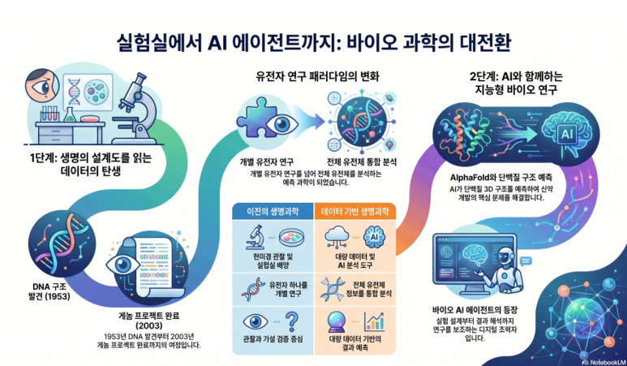

바이오는 이제 실험실 안에서만 이루어지는 과학이 아닙니다. 현미경으로 관찰하고, 세포를 배양하고, 생명 현상을 설명하던 생명과학은 이제 **데이터와 인공지능을 함께 다루는 과학**으로 넓어지고 있습니다.

DNA 염기서열을 읽고, 단백질 구조를 예측하고, 질병 데이터를 분석하고, 인공지능이 신약 후보물질을 찾는 시대가 되었습니다. 여기에 자동화 도구와 AI 에이전트까지 연결되면서 바이오는 새로운 방식으로 발전하고 있습니다.

이 글은 DNA 이중나선 구조의 발견에서 시작해 인간 게놈 프로젝트, 바이오 데이터, AlphaFold, 그리고 바이오 AI 에이전트까지 이어지는 흐름을 일반 독자도 이해할 수 있도록 정리한 글입니다.

## DNA 이중나선은 왜 중요했을까?

1953년 제임스 왓슨과 프랜시스 크릭은 DNA가 두 가닥이 꼬인 **이중나선 구조**를 가진다는 모델을 발표했습니다. 이 발견은 생명과학 역사에서 중요한 전환점이었습니다.

DNA의 구조를 알게 되면서 과학자들은 이런 질문에 더 가까이 다가갈 수 있었습니다.

- 유전 정보는 어디에 저장되어 있을까?
- 생명체는 어떻게 자신의 정보를 복제할까?
- 부모의 특징은 어떻게 다음 세대로 전달될까?

DNA는 생명체의 설계도와 비슷합니다. A, T, G, C라는 네 가지 염기가 일정한 순서로 배열되어 있고, 그 순서 안에 생명체의 특징을 결정하는 정보가 담겨 있습니다.

쉽게 말하면 **DNA는 생명체를 만드는 설명서**이고, **유전자는 그 설명서 안에 들어 있는 특정 기능의 문장**이라고 볼 수 있습니다.

## 유전자 하나에서 전체 게놈으로

DNA 구조를 이해한 뒤 과학자들은 더 큰 질문을 던지기 시작했습니다.

> 인간의 DNA 전체를 읽을 수 있을까?

이 질문에서 출발한 국제 연구가 **인간 게놈 프로젝트**입니다. 인간 게놈 프로젝트는 1990년에 시작되어 2003년에 완료되었고, 인간이 가진 전체 DNA 정보의 기준 서열을 밝히는 것을 목표로 했습니다.

이 프로젝트 이후 생명과학의 시야는 크게 달라졌습니다. 유전자 하나를 따로 보는 데서 그치지 않고, 생명체 전체의 유전 정보를 한꺼번에 분석하는 시대가 열린 것입니다.

| 이전의 생명과학 | 게놈 이후의 생명과학 |
| --- | --- |
| 유전자 하나를 중심으로 연구 | 전체 유전체를 함께 분석 |
| 실험과 관찰 중심 | 실험과 데이터 분석의 결합 |
| 질병 원인을 부분적으로 파악 | 개인 맞춤 의학 가능성 확대 |
| 가설을 세우고 확인 | 대량 데이터를 바탕으로 예측 |

게놈 프로젝트는 생명과학이 데이터 과학과 만나는 중요한 출발점이 되었습니다.

## 바이오 데이터가 폭발하다

게놈 프로젝트 이후 DNA를 읽는 기술은 빠르게 발전했습니다. 이제 사람, 동물, 식물, 미생물의 DNA 정보를 대량으로 분석할 수 있습니다.

바이오 분야에서 다루는 데이터도 점점 다양해지고 있습니다.

| 데이터 종류 | 내용 |
| --- | --- |
| 유전체 데이터 | DNA 염기서열 정보 |
| 전사체 데이터 | 어떤 유전자가 얼마나 발현되는지 보여주는 정보 |
| 단백질 데이터 | 단백질의 구조와 기능 |
| 대사체 데이터 | 세포 안에서 만들어지는 다양한 물질 |
| 의료 데이터 | 질병, 진단, 치료 반응 정보 |
| 이미지 데이터 | 현미경 사진, CT, MRI, 병리 이미지 |

문제는 이 데이터가 너무 많고 복잡하다는 점입니다. 사람이 하나씩 눈으로 보고 해석하기에는 한계가 있습니다. 그래서 바이오 분야에서도 인공지능이 중요한 도구로 등장했습니다.

## 인공지능은 바이오에서 무엇을 할까?

인공지능은 많은 데이터를 학습해 패턴을 찾는 기술입니다. 바이오 분야에서는 다음과 같은 일에 활용될 수 있습니다.

1. **유전자 데이터 분석**  
   어떤 유전자가 질병과 관련되어 있는지, 특정 돌연변이가 어떤 의미를 가지는지 찾는 데 도움을 줍니다.

2. **단백질 구조 예측**  
   단백질은 생명체 안에서 실제 일을 하는 분자입니다. 단백질의 모양은 기능과 깊은 관련이 있기 때문에 구조를 아는 것이 중요합니다.

3. **신약 후보물질 탐색**  
   질병과 관련된 단백질에 잘 결합할 수 있는 물질을 예측해 신약 개발의 출발점을 찾는 데 활용됩니다.

4. **의료 이미지 분석**  
   CT, MRI, 현미경 이미지, 병리 이미지에서 이상 패턴을 찾는 데 도움을 줄 수 있습니다.

5. **개인 맞춤형 치료 지원**  
   사람마다 유전 정보와 생활습관, 질병 반응이 다르기 때문에 AI는 데이터를 바탕으로 더 적절한 치료 전략을 제안하는 데 활용될 수 있습니다.

## AlphaFold가 보여준 변화

바이오 인공지능의 대표적인 사례 중 하나가 **AlphaFold**입니다.

단백질은 아미노산이 길게 연결된 분자입니다. 그런데 단백질은 단순한 긴 줄처럼 존재하지 않고, 3차원으로 접혀서 특정한 모양을 만듭니다. 이 모양이 단백질의 기능을 결정합니다.

예전에는 단백질 구조를 알아내기 위해 X선 결정학, NMR, 전자현미경 같은 실험 기술이 필요했습니다. 이런 방법은 매우 중요하지만 시간과 비용이 많이 들 수 있습니다.

AlphaFold는 인공지능을 이용해 단백질의 아미노산 서열로부터 3차원 구조를 예측하는 기술입니다. 2021년 Nature에 발표된 AlphaFold 연구는 단백질 구조 예측의 정확도를 크게 높인 사례로 평가됩니다.

2024년 노벨 화학상도 이 흐름을 보여주는 상징적인 사건이었습니다. 데이비드 베이커는 단백질 설계 연구로, 데미스 허사비스와 존 점퍼는 단백질 구조 예측 연구로 노벨 화학상을 받았습니다.

이제 인공지능은 단순히 글을 쓰거나 이미지를 만드는 기술을 넘어, 생명과학의 핵심 문제를 해결하는 도구로 활용되고 있습니다.

## 바이오 기술은 연결되어 발전한다

바이오의 변화는 하나의 기술만으로 이루어진 것이 아닙니다. 여러 기술이 서로 연결되면서 발전하고 있습니다.

| 핵심 기술 | 쉬운 설명 | 활용 예 |
| --- | --- | --- |
| DNA sequencing | DNA 염기서열을 읽는 기술 | 유전병 진단, 생물 종 동정 |
| NCBI / BLAST | 유전자 정보를 검색하고 비교하는 도구 | 미지의 생물 찾기, 유전자 비교 |
| 유전체 분석 | 전체 DNA 정보를 분석 | 질병 관련 유전자 탐색 |
| 전사체 분석 | 유전자 발현량 분석 | 암세포와 정상세포 비교 |
| 단백질 구조 예측 | 단백질의 3D 모양 예측 | 신약 개발, 효소 연구 |
| CRISPR 유전자 편집 | 특정 DNA 부분을 자르고 고치는 기술 | 유전자 기능 연구, 치료 연구 |
| 합성생물학 | 생명 시스템을 설계하고 제작 | 바이오 센서, 인공 세포 회로 |
| 바이오이미징 | 생명 현상을 이미지로 관찰 | 세포 관찰, 질병 진단 |
| AI 신약개발 | AI로 약물 후보를 찾는 기술 | 신약 후보물질 탐색 |
| 바이오 AI 에이전트 | AI가 연구 과정을 보조하는 시스템 | 논문 검색, 데이터 분석, 실험 설계 |

앞으로 바이오 분야에서는 실험 능력뿐 아니라 데이터를 이해하고, AI 도구를 활용하고, 생명 현상을 통합적으로 해석하는 능력이 점점 더 중요해질 것입니다.

## 바이오 AI 에이전트란 무엇일까?

요즘 많이 이야기되는 개념 중 하나가 **AI 에이전트**입니다.

일반적인 AI가 질문에 답하는 도구에 가깝다면, AI 에이전트는 목표를 주었을 때 여러 단계를 이어서 수행하는 도구에 가깝습니다.

예를 들어 누군가 이렇게 요청한다고 생각해봅시다.

> 이 DNA 서열이 어떤 생물의 것인지 찾아줘.

일반 AI는 검색 방법이나 해석 기준을 설명해줄 수 있습니다. 하지만 바이오 AI 에이전트는 다음과 같은 과정을 순서대로 도와줄 수 있습니다.

1. DNA 서열 입력받기
2. NCBI BLAST 검색 방법 안내하기
3. 검색 결과에서 유사도가 높은 생물 찾기
4. Query Cover, Percent Identity, E-value 해석하기
5. 결과를 표로 정리하기
6. "이 서열은 어떤 생물의 어떤 유전자일 가능성이 높다"는 결론 작성하기
7. 보고서나 블로그 글 형태로 정리하기

즉, 바이오 AI 에이전트는 단순한 챗봇이라기보다 **생명과학 연구 과정을 함께 수행하는 디지털 연구 보조원**에 가깝습니다.

## 바이오는 AI와 함께 발전하는 학문이다

생명과학은 더 이상 실험실 안에만 머무는 학문이 아닙니다. DNA 서열 데이터, 단백질 구조 데이터, 의료 이미지, 환자 정보, 논문 데이터가 서로 연결되면서 바이오는 거대한 데이터 기반 학문으로 변화하고 있습니다.

그리고 인공지능은 이 복잡한 데이터를 해석하는 강력한 도구가 되고 있습니다.

앞으로 바이오를 이해하려는 사람에게는 생물학 지식뿐 아니라 데이터와 AI를 함께 바라보는 관점이 필요합니다. NCBI, BLAST, 유전자, 단백질, AlphaFold, AI 에이전트 같은 개념은 이제 연구자만의 언어가 아니라 미래 바이오헬스 시대를 이해하기 위한 기본 교양이 되어가고 있습니다.

한 문장으로 정리하면 이렇습니다.

> 바이오의 변화는 DNA 구조를 발견한 것에서 시작해, 인간 게놈을 읽고, 이제는 인공지능이 유전자와 단백질, 질병 데이터를 분석하며 연구를 돕는 바이오 AI 에이전트 시대로 이어지고 있습니다.
