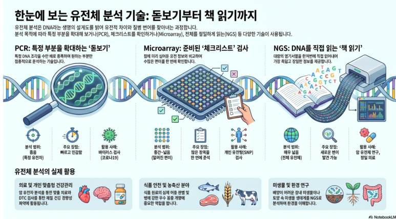

사람마다 생김새, 체질, 질병에 대한 민감성, 약물 반응이 조금씩 다릅니다. 이러한 차이는 생활습관과 환경의 영향을 받지만, 그 바탕에는 **DNA 정보의 차이**도 함께 작용합니다.

**유전체 분석**은 DNA에 담긴 정보를 읽고 비교하여 생명체의 특징, 유전적 차이, 질병과 관련된 변이, 미생물의 종류 등을 해석하는 기술입니다.

쉽게 말하면 다음과 같습니다.

* **DNA**는 생명체의 정보를 담고 있는 설계도입니다.
* **유전체(genome)**는 한 생명체가 가진 DNA 전체 정보입니다.
* **유전체 분석**은 그 설계도를 읽고, 의미 있는 차이를 찾아내는 과정입니다.



### DNA 정보는 무엇으로 이루어져 있을까?

DNA는 네 가지 염기로 구성됩니다.

| 염기 | 이름 |
| --- | --- |
| A | 아데닌 |
| T | 티민 |
| G | 구아닌 |
| C | 사이토신 |

DNA 정보는 이 네 글자의 배열로 표현됩니다.

```text
ATGGTGCACCTGACTCCTGAGG...
```

중요한 것은 **염기 자체보다 염기의 순서**입니다. 같은 A, T, G, C라도 어떤 순서로 배열되는지에 따라 유전 정보의 의미가 달라집니다.

따라서 유전체 분석은 크게 보면 **DNA 염기서열을 읽거나, 특정 위치에서 나타나는 차이를 확인하는 기술**이라고 할 수 있습니다.

### 유전체 분석에서 자주 만나는 기술

유전체 분석에는 하나의 기술만 쓰이지 않습니다. 목적에 따라 PCR, Microarray, NGS 같은 여러 방법을 선택하거나 함께 사용합니다.

| 기술 | 분석 대상 | 핵심 특징 |
| --- | --- | --- |
| PCR | 특정 DNA 조각 | 원하는 DNA 부분을 증폭합니다. |
| Real-time PCR | 특정 DNA 또는 RNA의 양 | 증폭 과정을 실시간으로 측정합니다. |
| Digital PCR | 매우 적은 양의 DNA | 희귀 변이나 미량 DNA를 정밀하게 측정합니다. |
| Microarray | 알려진 변이 또는 유전자 발현 | 미리 준비된 항목을 한 번에 검사합니다. |
| Genotyping | 특정 위치의 유전형 | 개인이나 생물종의 유전적 차이를 확인합니다. |
| NGS | DNA 또는 RNA 염기서열 | 대량의 염기서열을 직접 읽습니다. |

이 기술들은 서로 완전히 대체 관계가 아닙니다. 예를 들어 NGS로 넓은 범위의 변이를 찾은 뒤, Real-time PCR이나 Digital PCR로 특정 변이를 다시 확인할 수 있습니다.

### PCR: 특정 DNA를 확대해서 보는 기술

**PCR (Polymerase Chain Reaction)** 입니다. 특정 DNA 부분을 많이 복사하는 기술이며, 우리말로는 **중합효소 연쇄 반응**이라고 합니다.

DNA는 양이 너무 적으면 분석하기 어렵습니다. 그래서 연구자는 보고 싶은 DNA 구간을 정한 뒤, 그 부분만 선택적으로 증폭해 확인합니다.

핵심은 다음과 같습니다.

* 분석하고 싶은 DNA 구간을 정합니다.
* 그 구간을 반복적으로 복사합니다.
* 충분히 많아진 DNA를 이용해 존재 여부나 특징을 확인합니다.

PCR은 유전자 분석의 가장 기본적인 기술입니다. 감염병 검사, 유전자 확인, 식품 원료 검사, 연구 실험 등 다양한 분야에서 사용됩니다.

### Real-time PCR: DNA 양을 실시간으로 측정하다

**Real-time PCR**은 PCR이 진행되는 동안 증폭 신호를 실시간으로 측정하는 기술입니다.

일반 PCR이 “특정 DNA가 있는가?”를 확인하는 데 초점이 있다면, Real-time PCR은 **처음에 DNA나 RNA가 어느 정도 있었는지**를 추정하는 데 유리합니다.

활용 예시는 다음과 같습니다.

* 특정 바이러스나 세균 유전자의 검출
* 어떤 유전자가 얼마나 발현되었는지 분석
* 특정 변이의 존재 여부 확인
* GMO 또는 특정 외래 유전자 검사

흔히 알려진 코로나19 PCR 검사는 정확히는 바이러스 RNA를 DNA로 바꾼 뒤 정량 분석하는 **RT-qPCR** 방식에 가깝습니다. 그래서 “PCR 검사”라는 말 안에도 실제로는 여러 세부 기술이 포함될 수 있습니다.

### Digital PCR: 적은 양의 DNA를 더 정밀하게 세다

**Digital PCR**은 DNA를 아주 작은 반응 공간으로 나눈 뒤, 각 공간에서 표적 DNA가 검출되는지 확인하는 기술입니다.

전체 신호를 한꺼번에 보는 방식이 아니라, DNA 분자를 작은 단위로 나누어 세는 방식에 가깝습니다. 그래서 매우 적은 양의 DNA나 낮은 비율로 섞여 있는 변이를 찾는 데 강점이 있습니다.

주요 활용은 다음과 같습니다.

| 활용 분야 | 설명 |
| --- | --- |
| 희귀 변이 검출 | 정상 DNA 속에 아주 적게 섞인 변이 DNA를 찾습니다. |
| 암 관련 분석 | 혈액 속 암 유래 DNA 분석에 활용될 수 있습니다. |
| 복제수 분석 | 특정 유전자가 몇 개 있는지 확인합니다. |
| 정밀 정량 | 미량 DNA를 더 정확하게 측정합니다. |

다만 Digital PCR도 전체 유전체를 폭넓게 읽는 기술은 아닙니다. **이미 알고 있는 특정 표적을 정밀하게 확인하는 기술**로 이해하는 것이 적절합니다.

### Microarray: 유전자 체크리스트 검사

**Microarray**는 작은 칩 위에 수많은 DNA 탐침을 붙여 놓고, 샘플 DNA나 RNA가 어떤 탐침에 결합하는지 확인하는 기술입니다.

쉽게 말하면 **미리 만들어 둔 유전자 체크리스트에 샘플을 대조하는 방식**입니다.

Microarray는 다음과 같은 분석에 사용됩니다.

* 사람마다 다른 SNP 확인
* 유전자 발현량 비교
* 특정 DNA 구간의 복제수 변화 분석
* 작물, 가축, 미생물의 품종 또는 계통 분석

장점은 한 번에 많은 항목을 검사할 수 있다는 점입니다. 하지만 칩에 미리 들어 있는 정보만 확인할 수 있기 때문에, 완전히 새로운 변이를 발견하는 데는 NGS보다 제한이 있습니다.

### Genotyping: 특정 위치의 유전형을 확인하다

**Genotyping**은 특정 DNA 위치에서 어떤 유전형을 가지고 있는지 확인하는 분석입니다.

사람마다 DNA의 특정 위치가 조금씩 다를 수 있습니다. 대표적인 예가 **SNP(Single Nucleotide Polymorphism)**입니다. SNP는 DNA 염기 하나가 개인마다 다르게 나타나는 경우를 뜻합니다.

예를 들어 같은 위치에서 다음과 같은 차이가 있을 수 있습니다.

| 사람 | 유전형 |
| --- | --- |
| A | AA |
| B | AG |
| C | GG |

Genotyping은 개인 유전자 검사, 질병 연구, 약물 반응 연구, 품종 판별, 법의학 등에 활용됩니다.

다만 결과 해석에는 주의가 필요합니다. 많은 유전형 정보는 **확정 진단이 아니라 가능성이나 경향성**을 보여줍니다. 질병 판단에는 증상, 병력, 다른 검사 결과, 전문가의 해석이 함께 필요합니다.

### NGS: DNA 책의 글자를 직접 읽는 기술

**NGS (Next Generation Sequencing)** 입니다. 우리말로는 차세대 염기서열 분석이며, DNA 또는 RNA 조각의 염기서열을 대량으로 읽는 기술입니다.

NGS의 특징은 다음과 같습니다.

* 많은 DNA 조각을 동시에 읽을 수 있습니다.
* 특정 유전자뿐 아니라 넓은 범위의 유전체를 분석할 수 있습니다.
* DNA뿐 아니라 RNA 분석에도 활용됩니다.
* 분석 이후 컴퓨터 기반의 생물정보학 처리가 반드시 필요합니다.

NGS는 “항상 전체 유전체를 분석한다”는 뜻은 아닙니다. 목적에 따라 특정 유전자 패널만 분석할 수도 있고, 단백질을 만드는 엑솜 영역만 볼 수도 있으며, 전장유전체를 분석할 수도 있습니다.

| 분석 범위 | 의미 |
| --- | --- |
| 유전자 패널 | 질병이나 목적과 관련된 유전자 묶음을 분석합니다. |
| 엑솜 분석 | 단백질을 만드는 유전자 영역을 중심으로 분석합니다. |
| 전장유전체 분석 | DNA 전체를 폭넓게 분석합니다. |
| RNA 분석 | 어떤 유전자가 얼마나 발현되는지 확인합니다. |
| 미생물 DNA 분석 | 장내미생물, 토양미생물, 환경미생물 등을 분석합니다. |

### NGS 분석은 어떻게 진행될까?

NGS 분석은 단순히 장비에 샘플을 넣고 끝나는 과정이 아닙니다. 실험 기술, 장비, 컴퓨터 분석, 생물학적 해석이 함께 필요합니다.

일반적인 흐름은 다음과 같습니다.

1. 혈액, 조직, 세포, 미생물, 식품 등에서 시료를 준비합니다.
2. DNA 또는 RNA를 추출합니다.
3. 시퀀싱에 맞게 라이브러리를 제작합니다.
4. 장비로 염기서열을 읽습니다.
5. 데이터 품질을 확인합니다.
6. 기준 유전체와 비교하거나 서열을 조립합니다.
7. 변이, 발현량, 생물종 등을 분석합니다.
8. 생물학적 의미를 해석하고 보고서로 정리합니다.

이 과정에서 중요한 부분은 마지막 해석입니다. 같은 데이터라도 어떤 질문을 가지고 분석하느냐에 따라 결과의 의미가 달라질 수 있습니다.

### 유전체 분석은 어디에 활용될까?

유전체 분석은 의학뿐 아니라 식품, 농업, 축산, 환경, 미생물 연구까지 넓게 활용됩니다.

| 분야 | 활용 예 |
| --- | --- |
| 의학 | 암 유전자 분석, 유전질환 원인 탐색, 약물 반응 연구 |
| 개인 유전자 검사 | 영양, 운동, 피부, 탈모, 카페인 대사 관련 경향 확인 |
| 식품 | 원료 확인, 어종 판별, 식품 안전 검사 |
| 농업·축산 | 품종 개량, 병 저항성 분석, 가축 유전형 연구 |
| 환경·미생물 | 장내미생물, 토양미생물, 수질 미생물, 감염원 추적 |

예를 들어 식품에 표시된 어종이 실제로 맞는지 확인하거나, 토양 속 미생물 구성을 분석하거나, 암 조직에서 치료와 관련된 변이를 찾는 데 유전체 분석이 사용될 수 있습니다.

### PCR, Microarray, NGS를 한 문장으로 비교하면

세 기술은 다음처럼 구분하면 이해하기 쉽습니다.

* **PCR**은 특정 DNA 부분을 확대해서 보는 돋보기입니다.
* **Microarray**는 미리 준비된 유전자 체크리스트 검사입니다.
* **NGS**는 DNA 책의 글자를 직접 읽는 기술입니다.

즉, PCR은 좁고 정확하게 확인하는 데 강하고, Microarray는 알려진 많은 항목을 한 번에 보는 데 유리하며, NGS는 더 넓은 범위의 염기서열을 직접 읽는 데 강점이 있습니다.

### 왜 유전체 분석이 중요할까?

유전체 분석은 단순히 DNA를 읽는 기술이 아닙니다. 생명체의 특징을 이해하고, 질병의 원인을 찾고, 식품과 환경을 분석하며, 신약 개발과 정밀의료에도 연결되는 핵심 기술입니다.

최근에는 유전체 분석 데이터와 인공지능이 함께 활용되고 있습니다. AI는 방대한 유전체 데이터 속에서 패턴을 찾고, 질병 연구, 신약 개발, 미생물 분석, 개인 맞춤 의료 연구에 활용될 수 있습니다.

앞으로의 바이오 연구에서는 실험실 기술만큼이나 **생물정보학과 인공지능을 활용해 데이터를 해석하는 능력**이 중요해질 것입니다.

유전체 분석은 DNA를 읽는 기술에서 출발하지만, 결국은 생명 현상을 데이터로 이해하고 새로운 질문을 만들어가는 과정이라고 할 수 있습니다.
