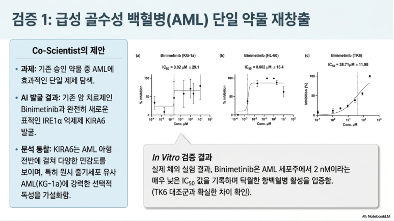

AI는 이제 단순히 정보를 찾아주거나 글을 요약하는 도구를 넘어가고 있습니다. 과학 연구에서는 AI가 논문과 데이터를 읽고, 새로운 가설을 만들고, 실험으로 확인할 만한 아이디어를 제안하는 단계까지 이야기되고 있습니다.

그 흐름을 보여주는 대표적인 사례가 **Google Co-Scientist**입니다. 이름 그대로 해석하면 "공동 과학자"라는 뜻이지만, 사람 과학자를 대신한다는 의미는 아닙니다. 오히려 과학자가 더 넓게 생각하고, 더 빠르게 가설을 검토할 수 있도록 돕는 **AI 연구 파트너**에 가깝습니다.

이 글에서는 Co-Scientist가 무엇인지, 왜 이런 AI가 필요한지, 그리고 바이오·의학 연구에서 어떤 가능성을 보여주는지 일반 독자도 이해할 수 있도록 정리해보겠습니다.

## Co-Scientist란 무엇일까?

Co-Scientist는 과학자가 연구 질문을 던졌을 때, 관련 지식과 데이터를 바탕으로 가능한 연구 가설을 만들어보고 그 가설을 검토하는 AI 시스템입니다.

일반적인 챗봇은 보통 이렇게 작동합니다.

> 이 논문을 요약해줘.

그러면 기존 정보를 읽고 핵심 내용을 정리해줍니다. 이것만으로도 유용하지만, Co-Scientist가 목표로 하는 역할은 조금 더 적극적입니다.

예를 들어 과학자가 이렇게 묻는다고 생각해볼 수 있습니다.

> 급성 골수성 백혈병 치료에 기존 약물을 새롭게 활용할 방법이 있을까?

이때 Co-Scientist는 단순히 관련 문헌을 찾아주는 데서 멈추지 않습니다. 가능한 가설을 여러 개 만들고, 그 가설의 약점을 검토하고, 더 설득력 있는 가설을 골라 실험으로 확인할 수 있는 방향을 제안합니다.

즉, Co-Scientist는 **가설 생성 → 검토 → 순위화 → 개선**이라는 과학적 사고 과정을 돕는 AI라고 볼 수 있습니다.

## 왜 이런 AI가 필요할까?

현대 과학은 정보가 너무 많습니다. 생명과학, 의학, 화학, 인공지능, 유전체학 등 여러 분야에서 논문과 데이터가 계속 쌓이고 있습니다.

한 명의 연구자가 모든 최신 연구를 깊이 이해하기는 어렵습니다. 그런데 중요한 발견은 종종 서로 다른 분야의 지식이 연결될 때 나옵니다.

예를 들어 암 연구에서 사용하던 약물이 간 섬유화 치료에도 도움이 될 가능성이 있다면, 암 연구와 간 질환 연구를 함께 바라봐야 합니다. 항생제 내성 문제도 미생물학, 유전학, 감염병 연구, 진화 생물학이 서로 연결되어야 이해할 수 있습니다.

Co-Scientist 같은 AI는 이런 넓은 범위의 지식을 연결해볼 수 있습니다. 사람이 놓칠 수 있는 연결고리를 찾고, 새로운 질문을 던지는 데 도움을 줄 수 있는 것입니다.

## Co-Scientist는 어떻게 작동할까?

Co-Scientist는 하나의 AI가 모든 일을 한 번에 처리하는 방식이라기보다, 여러 역할을 가진 AI 에이전트들이 함께 일하는 **멀티 에이전트 시스템**에 가깝습니다.

쉽게 말하면, 하나의 연구실 안에 여러 명의 AI 연구원이 있는 것처럼 생각할 수 있습니다.

| 에이전트 역할 | 하는 일 |
| --- | --- |
| Generation agent | 새로운 연구 가설을 만듭니다. |
| Reflection agent | 가설의 허점과 타당성을 검토합니다. |
| Ranking agent | 여러 가설 중 더 좋은 것을 순위화합니다. |
| Evolution agent | 좋은 가설을 더 발전시킵니다. |
| Proximity agent | 비슷한 가설을 묶고 중복을 줄입니다. |
| Meta-review agent | 전체 흐름을 점검하고 다음 개선 방향을 정리합니다. |

이 과정은 과학자들이 연구실 회의에서 아이디어를 내고, 서로 질문하고, 더 나은 실험 방향을 찾아가는 모습과 비슷합니다.

핵심은 AI가 한 번에 정답을 내놓는 것이 아니라는 점입니다. 여러 가능성을 만들고, 비교하고, 다시 다듬는 과정을 반복하면서 더 나은 연구 방향을 찾도록 설계되어 있습니다.

## 바이오·의학 연구에서 보여준 사례

Co-Scientist 연구에서는 바이오·의학 분야의 여러 문제를 다루었습니다. 여기서는 일반 독자가 이해하기 쉬운 세 가지 사례로 정리해보겠습니다.

### 1. 기존 약물을 새로운 치료에 활용할 수 있을까?

첫 번째 사례는 **급성 골수성 백혈병**과 관련된 약물 재창출입니다.

약물 재창출은 이미 다른 질병 치료에 쓰였거나 연구된 약물을 새로운 질병 치료에 활용할 수 있는지 살펴보는 방법입니다. 완전히 새로운 약을 처음부터 만드는 것보다 개발 시간을 줄일 가능성이 있습니다.

Co-Scientist는 기존 약물과 관련 연구를 바탕으로 급성 골수성 백혈병 치료에 활용할 수 있을 만한 후보를 제안했습니다. 연구에서는 일부 후보가 세포 수준의 초기 실험에서 효과를 보인 것으로 보고되었습니다.

다만 이 부분은 조심해서 읽어야 합니다. 세포 실험에서 효과가 있었다고 해서 곧바로 사람에게 치료제로 쓸 수 있다는 뜻은 아닙니다. 실제 치료로 이어지려면 동물실험, 전임상, 임상시험 같은 훨씬 긴 검증 과정이 필요합니다.

### 2. 간 섬유화 치료의 새로운 표적을 찾을 수 있을까?

두 번째 사례는 **간 섬유화**입니다.

간 섬유화는 간이 반복적으로 손상되면서 딱딱한 섬유성 조직이 쌓이는 현상입니다. 심해지면 간경변이나 간 기능 저하로 이어질 수 있습니다.

Co-Scientist는 간 섬유화와 관련된 새로운 후성유전학적 표적을 제안했습니다. 후성유전학은 DNA 염기서열 자체가 바뀌지 않아도 유전자 발현이 조절되는 현상을 연구하는 분야입니다.

이 사례는 AI가 단순히 "이미 알려진 지식"을 요약하는 데서 그치지 않고, 치료 가능성과 연결될 수 있는 새로운 관점을 제안할 수 있음을 보여줍니다.

### 3. 항생제 내성은 어떻게 퍼질까?

세 번째 사례는 **항생제 내성**과 관련된 세균 유전자 이동입니다.

항생제 내성은 세균이 항생제에 죽지 않고 살아남는 능력입니다. 문제는 내성 유전자가 세균 사이에서 이동할 수 있다는 점입니다.

Co-Scientist는 특정 유전 요소가 여러 세균 사이에서 어떻게 퍼질 수 있는지에 대한 메커니즘을 예측했습니다. 이후 연구자들이 독립적으로 발견한 실험 결과와 비슷한 방향의 가설을 제안했다는 점에서 주목을 받았습니다.

이 사례는 AI가 단순한 검색 도구를 넘어, 아직 충분히 정리되지 않은 과학적 가능성을 탐색하는 도구가 될 수 있음을 보여줍니다.

## 이 연구가 보여주는 의미

Co-Scientist 사례가 중요한 이유는 AI가 과학 연구에서 맡을 수 있는 역할이 달라지고 있음을 보여주기 때문입니다.

| 의미 | 설명 |
| --- | --- |
| 연구 아이디어 생성 | 사람이 놓칠 수 있는 연결고리를 AI가 찾아볼 수 있습니다. |
| 가설 검토 | 여러 가설을 비교하고 더 나은 방향으로 수정할 수 있습니다. |
| 실험 설계 보조 | 실험으로 확인 가능한 형태의 가설을 제안할 수 있습니다. |
| 융합 연구 촉진 | 의학, 생명과학, AI, 약학 등 여러 분야 지식을 연결할 수 있습니다. |
| 연구 속도 향상 | 후보 가설을 탐색하는 시간을 줄일 가능성이 있습니다. |

앞으로는 많은 정보를 외우는 능력만큼이나, AI가 제안한 정보를 비판적으로 판단하고 실험으로 검증하는 능력이 중요해질 수 있습니다.

## AI가 과학자를 완전히 대체할까?

그렇지는 않습니다. 오히려 이 지점이 가장 중요합니다.

Co-Scientist 같은 시스템은 과학자를 대신해 결론을 확정하는 도구가 아닙니다. AI가 만든 가설은 그럴듯해 보여도 틀릴 수 있습니다. AI가 참고한 문헌이나 데이터가 불완전할 수도 있습니다. 세포 실험에서 효과가 있었다고 해서 사람에게도 효과가 있다는 뜻도 아닙니다.

따라서 AI가 만든 가설은 반드시 전문가의 검토와 실험적 검증을 거쳐야 합니다.

Co-Scientist는 과학자를 대체하는 존재라기보다, 과학자가 더 넓고 빠르게 생각할 수 있도록 도와주는 **연구 보조자**로 이해하는 것이 적절합니다.

## 기억하면 좋은 한 문장

Co-Scientist는 논문과 데이터를 읽고, 새로운 연구 가설을 만들고, 스스로 검토하고, 과학자가 실험으로 확인할 수 있도록 도와주는 AI 공동 연구자입니다.

AI가 과학의 답을 대신 정해주는 시대라기보다, 과학자가 더 좋은 질문을 던지고 더 넓은 가능성을 살펴보도록 돕는 시대가 열리고 있습니다. 바이오와 의학 분야에서도 이런 변화는 앞으로 더 중요해질 가능성이 있습니다.

## 참고 출처

- Gottweis, J. et al. **Accelerating scientific discovery with Co-Scientist**. *Nature* (2026). [https://www.nature.com/articles/s41586-026-10644-y](https://www.nature.com/articles/s41586-026-10644-y)
- Google Research Blog. **Accelerating scientific breakthroughs with an AI co-scientist**. [https://research.google/blog/accelerating-scientific-breakthroughs-with-an-ai-co-scientist/](https://research.google/blog/accelerating-scientific-breakthroughs-with-an-ai-co-scientist/)
