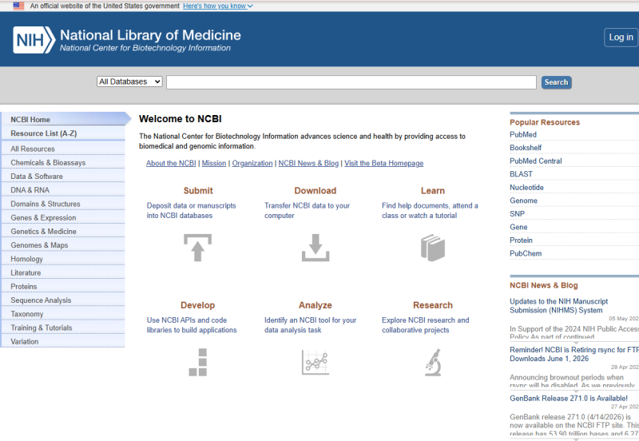
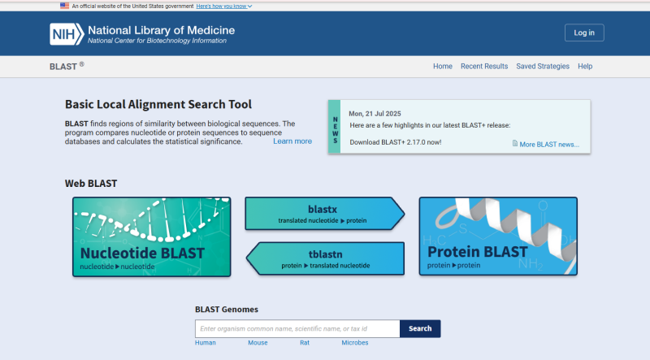

생명과학 수업에서는 DNA, 유전자, 염기서열을 배웁니다. DNA는 A, T, G, C라는 네 가지 염기로 이루어져 있고, 이 염기들의 순서에 따라 생물의 특징이 달라질 수 있습니다.

그렇다면 이런 질문도 해볼 수 있습니다.

- 어떤 생물의 DNA 일부만 알고 있다면, 그 생물이 무엇인지 알 수 있을까?
- 마트에서 산 생선이 정말 표시된 생선인지 DNA로 확인할 수 있을까?
- 어떤 DNA 서열이 질병과 관련된 유전자인지 알아낼 수 있을까?

이런 질문에 답할 때 실제 연구자들이 자주 사용하는 대표적인 생명정보 도구가 있습니다. 바로 **NCBI**와 **BLAST**입니다.

## NCBI란 무엇일까?

NCBI는 **National Center for Biotechnology Information**의 약자입니다. 우리말로는 미국 국립생물공학정보센터라고 할 수 있습니다.

NCBI는 생명과학과 의학 연구에 필요한 다양한 정보를 제공하는 공공 데이터베이스입니다. DNA, RNA, 단백질, 유전자, 논문, 질병 관련 정보 등을 검색할 수 있습니다.

쉽게 말하면, **NCBI는 전 세계 생명 정보를 모아 놓은 거대한 생명과학 도서관**입니다. 도서관에 책이 있다면, NCBI에는 DNA 서열, 유전자 정보, 단백질 정보, 논문 정보가 들어 있습니다.



NCBI 바로가기: [https://www.ncbi.nlm.nih.gov/](https://www.ncbi.nlm.nih.gov/)

## NCBI에서 찾을 수 있는 정보

NCBI에는 여러 데이터베이스가 있습니다. 수업에서 자주 활용할 만한 것은 다음과 같습니다.

| 데이터베이스 | 무엇을 찾을 수 있나? | 활용 예시 |
| --- | --- | --- |
| Nucleotide | DNA, RNA 염기서열 | 미지의 DNA 서열 검색 |
| Gene | 유전자 이름, 위치, 기능 | BRCA1 같은 질병 관련 유전자 확인 |
| Protein | 단백질 서열과 정보 | 유전자가 만드는 단백질 확인 |
| PubMed | 생명과학·의학 논문 | 심화 탐구 자료 검색 |
| BLAST | 비슷한 서열 검색 | 생물 종 동정, DNA 바코딩, 유전자 찾기 |

NCBI의 **Nucleotide** 데이터베이스는 GenBank, RefSeq, TPA, PDB 등 여러 출처의 DNA와 RNA 서열 정보를 모아 놓은 자료입니다. 유전체, 유전자, 전사체 서열 정보는 생명의학 연구와 발견의 기초 자료로 활용됩니다.

또한 **Gene** 데이터베이스는 여러 생물종의 유전자 정보를 통합하여 제공하며, 유전자 이름, RefSeq, 지도, 경로, 변이, 표현형 정보 등을 포함할 수 있습니다.

## NCBI를 왜 배울까?

NCBI를 배우는 이유는 단순히 사이트 사용법을 익히기 위해서만은 아닙니다. NCBI를 사용하면 교과서 속 개념이 실제 연구와 연결됩니다.

예를 들어 DNA 염기서열을 알면 다음과 같은 탐구가 가능합니다.

- 정체불명의 생물이 무엇인지 추정하기
- 식품 속 생선이나 고기의 실제 종 확인하기
- 특정 DNA 서열이 어떤 유전자인지 찾기
- 유전자와 질병의 관련성 알아보기
- 생물 사이의 유사성과 진화적 관계 생각해보기

즉, NCBI는 단순한 검색 사이트가 아니라 **생명과학 데이터를 직접 탐구할 수 있는 연구 도구**입니다.

## BLAST란 무엇일까?

BLAST는 **Basic Local Alignment Search Tool**의 약자입니다.

BLAST는 DNA나 단백질 서열을 데이터베이스에 있는 서열과 비교하여 서로 비슷한 부분을 찾아주는 도구입니다. NCBI는 BLAST가 생물학적 서열 사이의 국소적 유사성을 찾고, DNA나 단백질 서열을 데이터베이스와 비교하며, 결과의 통계적 의미를 계산한다고 설명합니다.

쉽게 말하면, **BLAST는 DNA 검색 엔진**입니다.

구글 검색창에 문장을 넣으면 비슷한 문서나 웹페이지를 찾아주듯이, BLAST 검색창에 DNA 서열을 넣으면 비슷한 DNA 서열을 가진 생물이나 유전자를 찾아줍니다.



BLAST 바로가기: [https://blast.ncbi.nlm.nih.gov/Blast.cgi](https://blast.ncbi.nlm.nih.gov/Blast.cgi)

## BLAST로 무엇을 할 수 있을까?

BLAST는 실제 연구와 교육에서 널리 사용됩니다. 수업에서는 다음과 같은 질문을 다룰 수 있습니다.

| 실습 주제 | 질문 | BLAST로 찾는 것 |
| --- | --- | --- |
| 미지의 생물 종 동정 | 이 DNA는 어떤 생물의 것일까? | 가장 비슷한 생물 |
| 식품 속 생선 판별 | 이 생선은 진짜 참치일까? | DNA 바코딩 결과 |
| 질병 유전자 찾기 | 이 서열은 어떤 유전자일까? | 유전자 이름과 기능 |

BLAST는 서열 사이의 기능적 관계나 진화적 관계를 추정하거나, 유전자 가족 구성원을 찾는 데에도 활용될 수 있습니다.

## BLAST의 기본 원리

DNA는 A, T, G, C 네 글자로 이루어진 긴 문장이라고 생각할 수 있습니다.

예를 들어 다음과 같은 DNA 서열이 있다고 해봅시다.

```text
ATGGATTTATCTGCTCTTCGCGTTGAAGAAGTACAAAATGTC
```

BLAST는 이 서열을 NCBI 데이터베이스에 저장된 수많은 DNA 서열과 비교합니다. 그리고 다음과 같은 질문에 답할 수 있도록 도와줍니다.

- 이 서열과 가장 비슷한 생물은 무엇인가?
- 얼마나 비슷한가?
- 우연히 비슷하게 나온 결과일 가능성은 낮은가?
- 이 서열은 어떤 유전자일 가능성이 높은가?

즉, BLAST는 DNA 서열을 비교해서 가장 유사한 후보를 찾아주는 도구입니다.

## Nucleotide BLAST 사용법

Nucleotide BLAST는 DNA 또는 RNA 염기서열을 입력해 비슷한 염기서열을 찾는 도구입니다.

사용 순서는 다음과 같습니다.

1. 인터넷에서 `NCBI BLAST`를 검색합니다.
2. BLAST 페이지에 접속합니다.
3. **Nucleotide BLAST**를 클릭합니다.
4. **Enter Query Sequence** 칸에 DNA 서열을 붙여넣습니다.
5. Database를 선택합니다. 수업에서는 보통 기본값 또는 Standard database를 사용하면 됩니다.
6. 매우 비슷한 서열을 찾을 때는 **Highly similar sequences**를 선택합니다.
7. 조금 덜 비슷한 서열까지 찾고 싶을 때는 **Somewhat similar sequences**를 선택합니다.
8. **BLAST** 버튼을 클릭합니다.
9. 결과에서 생물 이름, 유전자 이름, Percent Identity, Query Cover, E-value를 확인합니다.

NCBI BLAST FAQ에서도 기본 사용법은 간단합니다. 서열을 query box에 붙여넣고, 적절한 데이터베이스를 선택한 뒤 BLAST 버튼을 누르면 됩니다.

## BLAST 결과에서 꼭 봐야 할 것

BLAST 결과 화면에는 많은 정보가 나옵니다. 처음 보면 복잡하게 느껴질 수 있지만, 수업에서는 다음 항목을 중심으로 보면 됩니다.

### 1. Description

검색 결과의 제목입니다. 입력한 DNA 서열이 어떤 생물의 어떤 유전자 또는 서열과 비슷한지 보여줍니다.

예를 들어 Description에 다음과 같은 말이 보일 수 있습니다.

```text
Thunnus albacares cytochrome c oxidase subunit I gene
```

이 말은 입력한 서열이 **Thunnus albacares**, 즉 황다랑어의 COI 유전자와 비슷하다는 뜻입니다.

### 2. Scientific Name

Scientific Name은 생물의 학명입니다. 학명은 전 세계 과학자들이 공통으로 사용하는 생물 이름입니다.

| 학명 | 일반 이름 |
| --- | --- |
| Homo sapiens | 사람 |
| Mus musculus | 생쥐 |
| Drosophila melanogaster | 초파리 |
| Thunnus albacares | 황다랑어 |

### 3. Percent Identity

Percent Identity는 두 서열이 얼마나 같은지를 백분율로 나타낸 값입니다.

| Percent Identity | 의미 |
| --- | --- |
| 100% | 비교한 부분의 염기가 모두 같음 |
| 99% | 거의 같음 |
| 95% 이상 | 매우 유사함 |
| 80~90% | 관련은 있지만 차이가 있음 |
| 낮은 값 | 관련성이 약할 수 있음 |

쉽게 말하면, **Percent Identity는 DNA 글자가 몇 퍼센트나 같은지를 보여주는 값**입니다. 높을수록 더 비슷합니다.

### 4. Query Cover

Query Cover는 내가 입력한 DNA 서열 중에서 검색 결과와 비교된 부분의 비율입니다.

예를 들어 100개의 염기로 이루어진 DNA 서열을 입력했는데, 그중 95개 염기가 검색 결과와 비교되었다면 Query Cover는 약 95%입니다.

| Query Cover | 의미 |
| --- | --- |
| 100% | 입력한 서열 전체가 비교됨 |
| 90% 이상 | 대부분 비교됨 |
| 낮은 값 | 일부만 비슷할 가능성이 있음 |

즉, **Query Cover는 내가 넣은 DNA 서열 중 얼마만큼이 검색 결과와 겹쳤는지를 보여주는 값**입니다.

### 5. E-value

E-value는 BLAST 결과에서 가장 어렵지만 중요한 값입니다.

쉽게 말해, E-value는 **이 정도로 비슷한 결과가 우연히 나올 가능성과 관련된 값**입니다.

| E-value | 해석 |
| --- | --- |
| 0.0 | 우연일 가능성이 거의 없음 |
| 1e-50 | 매우 신뢰도 높은 결과 |
| 1e-10 | 의미 있는 결과일 가능성이 큼 |
| 0.01 이하 | 일반적으로 의미 있는 결과로 볼 수 있음 |
| 1 이상 | 우연히 비슷하게 나온 결과일 수 있음 |

학생들이 기억해야 할 핵심은 간단합니다.

> E-value는 낮을수록 좋습니다. 0에 가까울수록 우연이 아닐 가능성이 큽니다.

## BLAST 결과 해석 순서

BLAST 결과를 볼 때는 다음 순서로 확인하면 좋습니다.

1. 가장 위에 있는 결과를 확인합니다.
2. 생물 이름 또는 유전자 이름을 확인합니다.
3. Percent Identity가 높은지 봅니다.
4. Query Cover가 충분히 높은지 봅니다.
5. E-value가 0 또는 매우 낮은지 봅니다.
6. 상위 3개 결과가 서로 비슷한 생물인지 비교합니다.
7. 최종 결론을 씁니다.

## 수업에서 기억하면 좋은 한 문장

NCBI는 생명 정보를 모아 놓은 데이터베이스이고, BLAST는 DNA나 단백질 서열을 검색해 비슷한 생물 또는 유전자를 찾아주는 도구입니다.

교과서에서 배운 DNA 염기서열이 실제 연구 도구와 연결되는 순간, 학생들은 생명과학을 조금 더 탐구의 언어로 바라볼 수 있습니다. 기록해두면 DNA 바코딩, 질병 유전자 탐구, 생물 종 동정 수업으로 확장할 때도 도움이 됩니다.
